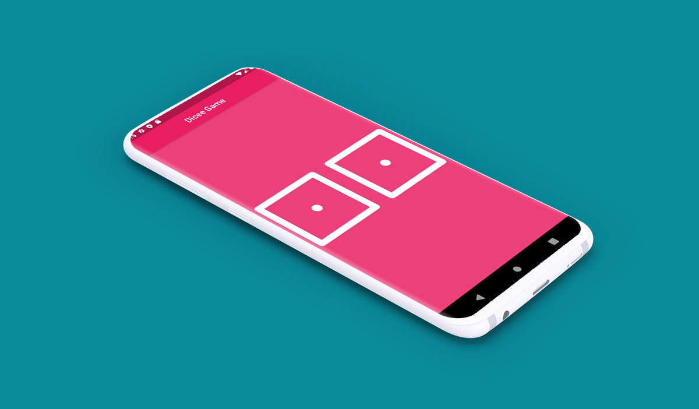

# Flutter Dice Game :art:

Our Third Flutter project. Here we learn to build app from scratch with Stateful widget. We also learned about Expand Class, Image widget, FlatButton, Dart math Library, Random Class and so on. :bookmark:

## Project Resuls

