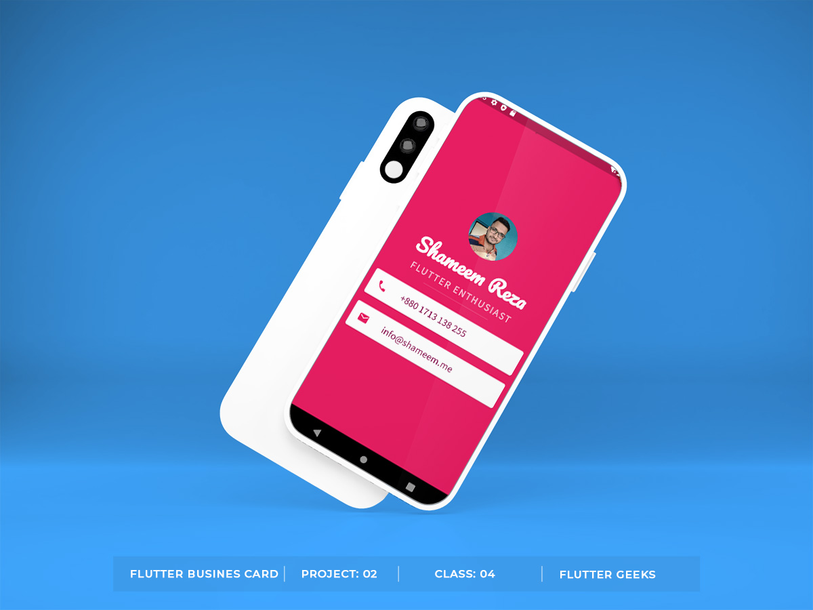

# Flutter Geek Card :memo:

Our Second Flutter project. Here we learn to build app from scratch with some prebuild widget. We also learned about Column, Row, using Icons, Card, User profile and custom fonts. :bookmark:

## Project Output

